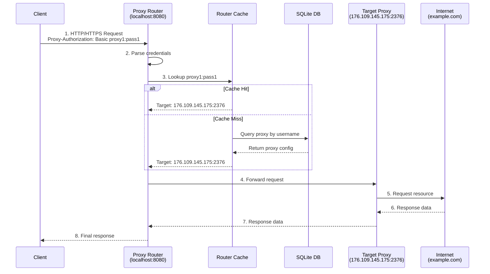
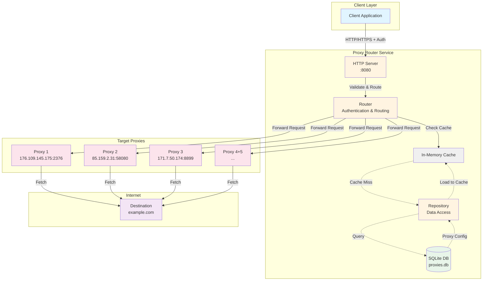

# Proxy Router

A high-performance HTTP/HTTPS proxy router written in Go that allows you to manage multiple proxy servers through a single endpoint with authentication-based routing.

## How It Works
### Request Flow Diagram


## Architecture Diagram


## Features

- 🔐 **Authentication-based routing** - Route requests to different proxies based on username/password
- 🚀 **HTTP & HTTPS support** - Full support for both HTTP and HTTPS (CONNECT tunneling)
- 💾 **SQLite storage** - Persistent proxy configuration with SQLite database
- ⚡ **In-memory caching** - Fast proxy lookup with automatic caching
- 🏗️ **Clean architecture** - Repository pattern for easy testing and extensibility
- 🔄 **Thread-safe** - Concurrent request handling with mutex protection
- 📊 **CRUD operations** - Easy proxy management (Create, Read, Update, Delete)

## Installation


## Usage

### Quick Start

```bash
# Run the application
make run start
```

The server will start on `localhost:8080` and create a `proxies.db` SQLite database with sample proxies.

### Import proxy
```bash
# import proxy
make build
./.bin/proxy-router import --file ./proxies.txt
```


## Performance

- **In-memory caching** ensures fast proxy lookup (O(1) complexity)
- **Connection pooling** for database queries
- **Concurrent request handling** with goroutines
- **Thread-safe operations** with mutex locks

## Testing

```bash
# Run all tests
go test ./...

# Run tests with coverage
go test -cover ./...

# Run tests with race detection
go test -race ./...
```

## Contributing

Contributions are welcome! Please feel free to submit a Pull Request.

1. Fork the repository
2. Create your feature branch (`git checkout -b feature/amazing-feature`)
3. Commit your changes (`git commit -m 'Add some amazing feature'`)
4. Push to the branch (`git push origin feature/amazing-feature`)
5. Open a Pull Request

## Roadmap
- [x] Check aliveness of target proxies
- [x] Automatic removal of dead proxies
- [x] Configuration file support (YAML/JSON)
- [ ] REST API for proxy management
- [ ] Web UI dashboard
- [ ] Load balancing between multiple proxies
- [ ] Request/response logging
- [ ] Statistics and metrics
- [ ] Support for SOCKS5 protocol
- [ ] Docker support
- [ ] Rate limiting per user

## License

MIT License - see the [LICENSE](LICENSE) file for details

## Acknowledgments

- Built with [go-sqlite3](https://github.com/mattn/go-sqlite3)
- Inspired by various proxy rotation tools

## Support

If you have any questions or issues, please open an issue on GitHub.
